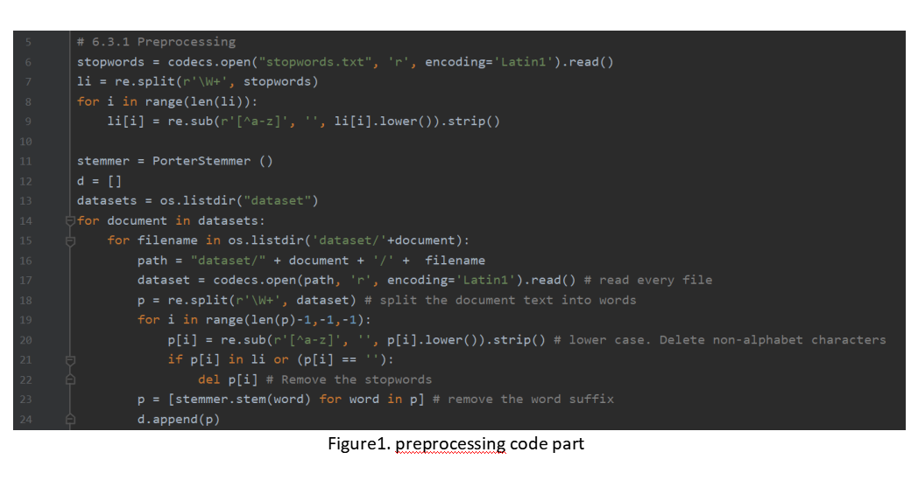
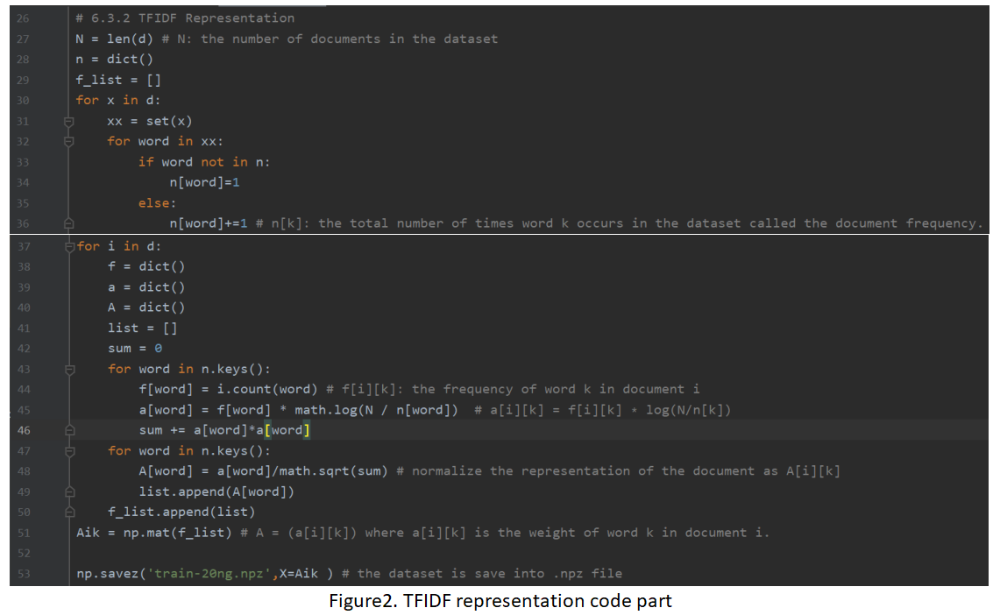
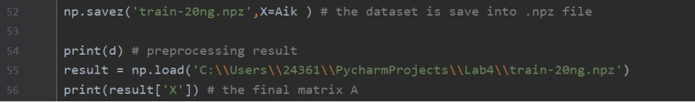
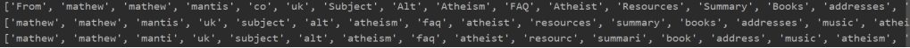
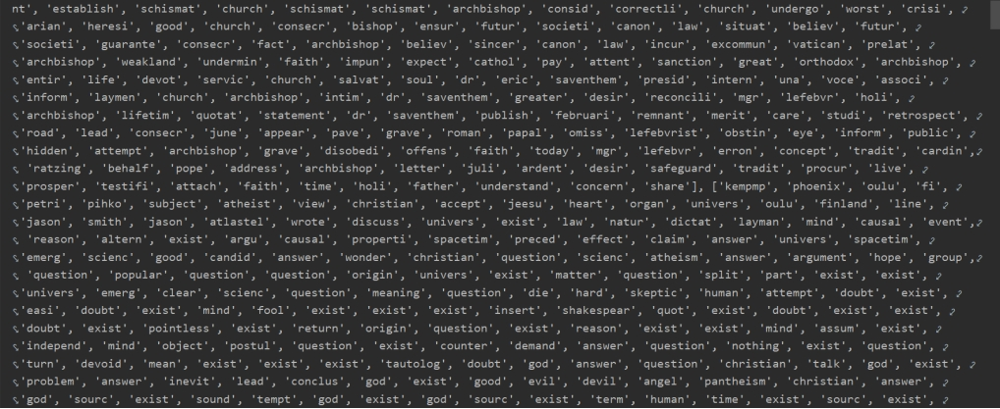
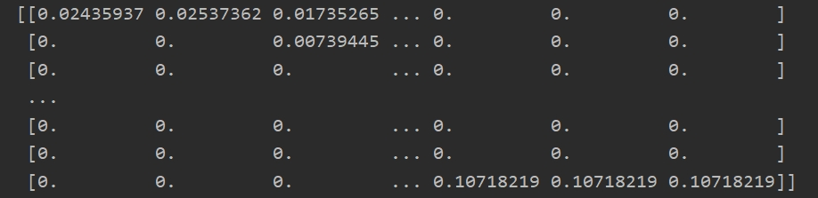

# Feature Generation –  TFIDF Representation 

### Introduction

Text categorization is to label every document in a set by predefined labels. The first step is to preprocessing texts including text extraction, invalid words removal, text normalization and many other operations, in which way, texts becomes more formal and efficient and are ready for further calculations. Then, tfifidf function is applied to represent the document as vector space model and the unique words in the dataset are used to show one dimension of the dataset. In this project, it need to use python language to preprocess the texts and do TFIDF representation.

### Design & Implementation

##### Design principals

###### 1、Preprossing stage:

- First step: Data is read by using os.listdir() indexing all the files.  Use re.split(r’\W+’,dataset) to split the string by non-word symbols and store the splited words in a document into a list called ‘p’.

- Second step:  Go through the array backwards and use re.sub(r'[^a-z]', '', p[i].lower()).strip() to lowercase the words and turn non-alphabetic element into null. Then, every word is checked whether is in the stopwords list and if the word is null. If so, dell them from the list to remove the words which carry no meaning. Also, it should read and process the stopwords by the same way of datasets in advance so that stopwords can be checked successfully.

- Third step: Install nltk library and use stemmer to remove the word suffix. In the end, the list p is stored into the list d  by document in order.

###### 2、TFIDF representation stage:

- Firstly, calculate the overall unique words in the datasets and store the word with responding times it occurs in the datasets in the dictionary ‘n’ as the form of “n[word] = frequency in datasets”. Besides, calculate the length of the list d as ‘N’, which is the number of documents in the datasets.

- Secondly, go through the words in the dictionary to calculate how many files contains the word and save in the dictionary a as the form of “a[word] = document frequency ”. At the same time, add the square of all the a[word] in a document as ‘sum’ for the next step.

- Thirdly, for every word in every document, do the calculation of A[word] = , where sum =  and D = the number of all the unique words in the datasets. All the A[word]s in a document store in the list called “list” in order and all the lists of different document store in a list called “f_list” in order.

- Finally, use np.mat(f_list) to transfer the list into a matrix AN*D where N is the number of document in the datasets and D is the number of all the unique words occurred in the document. Save the matrix into npz file and that is the final matrix.

##### Implementation

### Test

In the end, the matrix A is save into .npz file. The processing part result and the matrix A is printed to show the final result.

Here is an example of test:

 
Figure3. the example objects

 

Figure4. the example objects: the clipped output result of three steps of  6.3.1 ( each row reprensent each step respectively, and it is part of resluts of the first document)

Figure5. The test result: preprossing result

Figure6. The test result: matrix A

